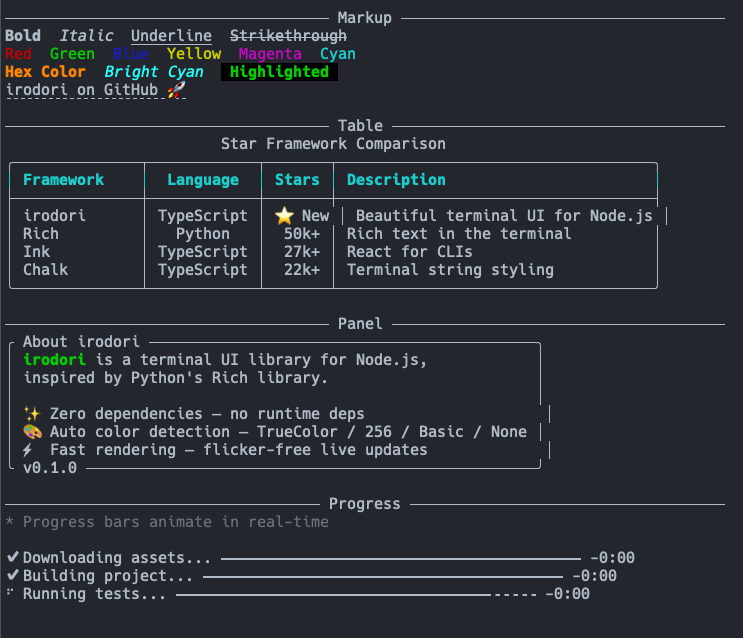

# irodori

> Beautiful terminal UI for Node.js — inspired by the Python library [rich](https://github.com/Textualize/rich)

A zero-dependency, all-in-one terminal UI library that brings Rich-like markup, tables, progress bars, spinners, and live rendering to Node.js.



## Features

- **Markup** — `[bold red]Hello[/] World` style inline formatting
- **Tables** — Automatic column sizing with Unicode-aware width calculation
- **Panels** — Bordered content boxes with title and padding
- **Progress** — Multi-task progress bars with ETA, spinners, and transfer speed
- **Status** — Spinner-based status indicator for operations with unknown duration
- **Live** — Efficient cursor-based rendering with flicker-free updates
- **Color** — Automatically detects terminal color support (TrueColor / 256 / Basic / None)
- **Emoji** — `:emoji_name:` shorthand replacement with actual emoji characters
- **Zero dependencies** — No runtime dependencies; only devDependencies for build and test

## Requirements

- Node.js 18 or later

## Installation

```bash
npm install irodori
```

## Quick Start

```ts
import { console } from 'irodori';

// Markup-styled output
console.print('[bold green]Success![/] Task completed.');

// Horizontal rule
console.rule('Section Title');

// Timestamped log (uses irodori's enhanced console)
console.log('Server started on port 3000');
```

## Usage

### Markup

```ts
import { console } from 'irodori';

console.print('[bold]Bold[/] [italic red]Italic Red[/] [underline]Underline[/]');
console.print('[#ff8800]Hex color[/] [bright_cyan]Named color[/]');
console.print('[link=https://example.com]Click here[/]');
```

### Table

```ts
import { Table, console } from 'irodori';

const table = new Table({
  title: 'Users',
  columns: [
    { header: 'Name' },
    { header: 'Email' },
    { header: 'Role', justify: 'center' },
  ],
});

table.addRow(['Alice', 'alice@example.com', 'Admin']);
table.addRow(['Bob', 'bob@example.com', 'User']);

console.print(table);
```

### Panel

```ts
import { Panel, console } from 'irodori';

const panel = new Panel('Hello from [bold]irodori[/]!', {
  title: 'Welcome',
  border: 'rounded',
});

console.print(panel);
```

### Progress

```ts
import { Progress } from 'irodori';

await Progress.run(async (progress) => {
  const taskId = progress.addTask('Downloading...', { total: 100 });

  for (let i = 0; i < 100; i++) {
    await new Promise((r) => setTimeout(r, 50));
    progress.advance(taskId);
  }
});
```

### Status / Spinner

```ts
import { status } from 'irodori';

const result = await status('Processing...', async () => {
  await new Promise((r) => setTimeout(r, 2000));
  return 'done';
});
```

### Live Rendering

```ts
import { Live } from 'irodori';

await Live.run(async (live) => {
  for (let i = 0; i <= 10; i++) {
    live.update(`Step ${i}/10`);
    await new Promise((r) => setTimeout(r, 200));
  }
});
```

## Color Level Detection

irodori automatically detects your terminal's color capabilities:

| Level | Description |
|-------|-------------|
| `ColorLevel.TrueColor` | 16 million colors (24-bit) |
| `ColorLevel.Color256` | 256 colors |
| `ColorLevel.Basic` | 16 standard colors |
| `ColorLevel.None` | No color (plain text fallback) |

You can override detection:

```ts
import { Console, ColorLevel } from 'irodori';

const con = new Console({ colorLevel: ColorLevel.TrueColor });
```

## API Overview

### Console

| Method | Description |
|--------|-------------|
| `print(...args)` | Output markup strings or `Renderable` objects |
| `log(message)` | Timestamped log output |
| `rule(title?)` | Horizontal rule with optional title |
| `line(count?)` | Print empty lines |
| `printException(error)` | Pretty-print an error with stack trace |
| `capture(fn)` | Capture output as a string (useful for testing) |

### Widgets

| Class | Description |
|-------|-------------|
| `Table` | Auto-sized table with borders and alignment |
| `Panel` | Bordered content box with title |
| `Rule` | Horizontal rule (standalone widget) |

### Progress Columns

| Class | Description |
|-------|-------------|
| `SpinnerColumn` | Animated spinner |
| `TextColumn` | Task description with template placeholders |
| `BarColumn` | Visual progress bar |
| `PercentageColumn` | Percentage display |
| `TimeElapsedColumn` | Elapsed time (h:mm:ss) |
| `TimeRemainingColumn` | Estimated remaining time |
| `FileSizeColumn` | Human-readable file size |
| `TransferSpeedColumn` | Transfer speed (bytes/s) |
| `MofNCompleteColumn` | M/N completion count |

## Renderable Interface

Any object implementing the `Renderable` interface can be passed to `console.print()`:

```ts
import type { Renderable, RenderOptions } from 'irodori';

const widget: Renderable = {
  render(options: RenderOptions): string[] {
    return [`Width: ${options.width}, Colors: ${options.colorLevel}`];
  },
};
```

## License

[MIT](LICENSE)
